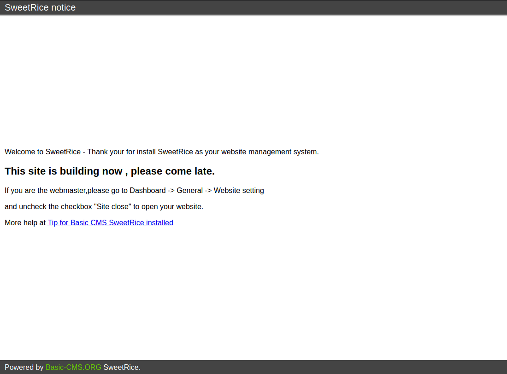
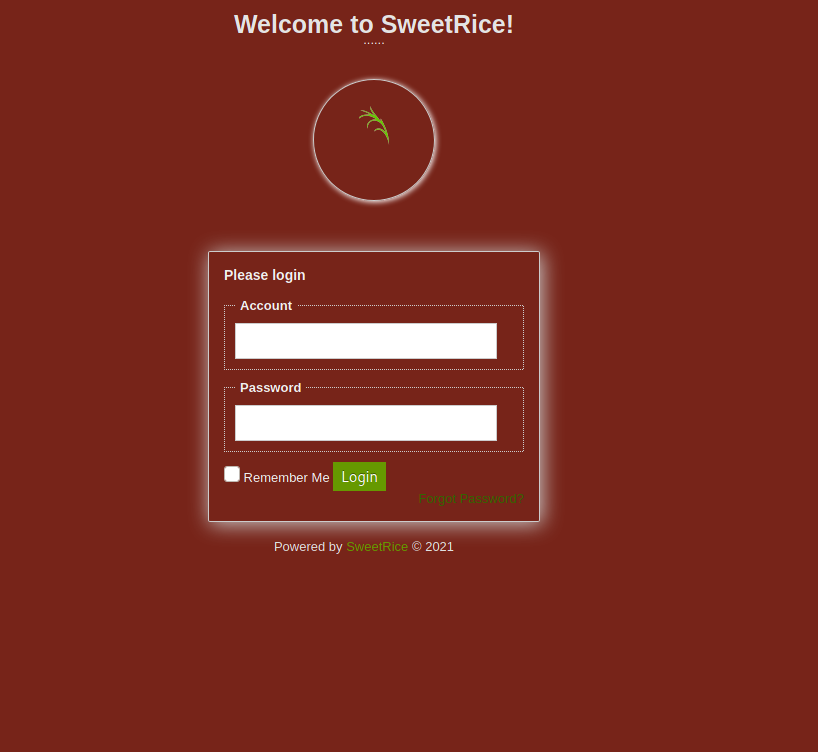
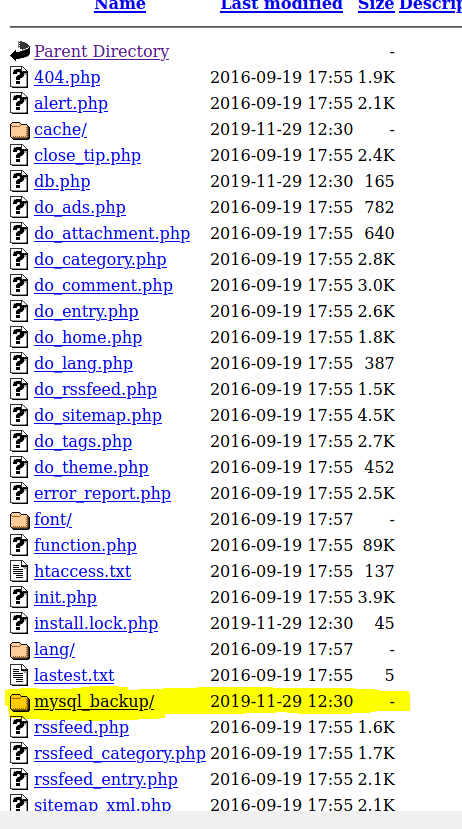
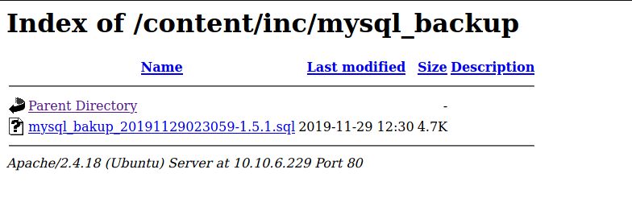
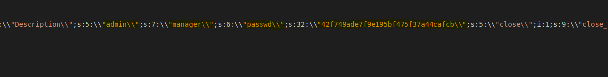
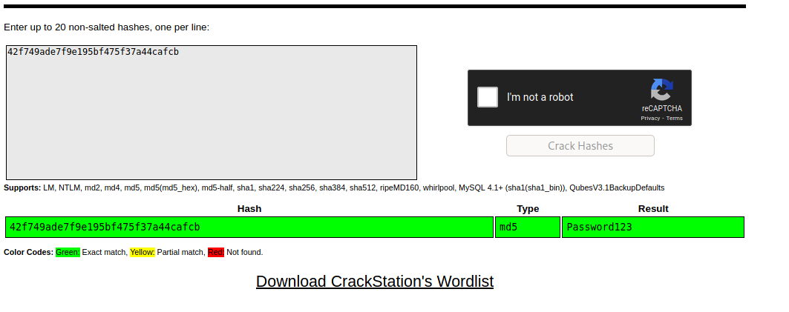

# thm-lazyadmin-writeup

Esto es un "writeup" de la sala [Lazyadmin](https://tryhackme.com/room/lazyadmin) de tryhackme

## 1. RECON

Empezamos con el reconocimiento de de la maquina por un escaneo de puertos abiertos.

> nmap -Pn -sT -p- IPMACHINE -oN port_scan.txt

``` PORT   STATE SERVICE
22/tcp open  ssh
80/tcp open  http 
```
(para mas info buscar en el repo el fichero _port_scan.txt_)

En caso de no entender bien la sintaxis recomiendo la sala [nmap](https://tryhackme.com/room/furthernmap)

Para resumirlos parametro:
  * -Pn : Impide que nmap haga ping a la maquina.
  * -sT : Utiliza el scaneo tipo TCP.
  * -p- : Esto le indica que lo haga sobre todos los puertos. (0 a 65535)
  * -oN : Guarda la salida en modo normal del comando en un fichero para poder se consultado.

```


```

Sabiendo los puertos descubiertos procedemos a descubrir los servicios de estos puertos, sistema opertivo y pasamos los scripts por defecto.

> nmap -Pn -sT -sV -sC -p22,80 IPMACHINE -O -oN service_scan.txt

```PORT   STATE SERVICE VERSION
22/tcp open  ssh     OpenSSH 7.2p2 Ubuntu 4ubuntu2.8 (Ubuntu Linux; protocol 2.0)
| ssh-hostkey: 
|   2048 49:7c:f7:41:10:43:73:da:2c:e6:38:95:86:f8:e0:f0 (RSA)
|   256 2f:d7:c4:4c:e8:1b:5a:90:44:df:c0:63:8c:72:ae:55 (ECDSA)
|_  256 61:84:62:27:c6:c3:29:17:dd:27:45:9e:29:cb:90:5e (ED25519)
80/tcp open  http    Apache httpd 2.4.18 ((Ubuntu))
|_http-server-header: Apache/2.4.18 (Ubuntu)
|_http-title: Apache2 Ubuntu Default Page: It works
Service Info: OS: Linux; CPE: cpe:/o:linux:linux_kernel
```
(para mas info buscar en el repo el fichero _service_scan.txt_)

Parametros Nuevos:
  * -sV : Permite descubrir los servicios y versiones que corren en los puertos.
  * -sC : Tambien se escribe --script=defualt lanza los scritp en la categoria _default_ de nmap.
  *  -p22,80 : esto centra el foco solo en los puertos mencionados. (En este caso 22,80)
  *  -O : Intenta descubrir el sistema operativo

```


```

Sabiendo que el puerto 80 corre una version de Apache para Ubuntu, procedemos a la enumeracion de directorios usando gobuster.

Gobuster no viene por defecto en kali para instalarlo usa __sudo apt-get install gobuster__ o puedes usar __dirb__ que ya esta en kali.

> gobuster dir -u http://IPMACHINE -w /usr/share/wordlist/dirb/big.txt -o godir_scan.txt

```
/content              (Status: 301) [Size: 314] [--> http://10.10.115.41/content/]
```
(para mas info buscar en el repo el fichero _godir_scan.txt_)

En caso de no entender bien la sintaxis recomiendo la sala [vulnversity](https://tryhackme.com/room/vulnversity) en el apartado de gobuster o visitar  el github del creador [gobuster](https://github.com/OJ/gobuster)

Parametros:
  * dir : gobuster tiene varios modos para nuestro caso elegimos _dir_.
  * -u : Define la URL.
  * -w : Diccionario para sus pruebas.
  * -o : Guarda la salida del comando en un fichero.

```


```

Visitamos la pagina http://IPMACHINE/content



Nos encontramos la home de un CMS llamado _sweetrice_, sobre esta base realizamos otra enumeracion con go buster

> gobuster dir -u http://IPMACHINE/content -w /usr/share/wordlist/dirb/big.txt -x php,cgi,html,py,js,css,sh,txt -o godir_scan.txt

```/_themes              (Status: 301) [Size: 322] [--> http://10.10.115.41/content/_themes/]
/as                   (Status: 301) [Size: 317] [--> http://10.10.115.41/content/as/]
/attachment           (Status: 301) [Size: 325] [--> http://10.10.115.41/content/attachment/]
/changelog.txt        (Status: 200) [Size: 18013]
/images               (Status: 301) [Size: 321] [--> http://10.10.115.41/content/images/]
/inc                  (Status: 301) [Size: 318] [--> http://10.10.115.41/content/inc/]
/index.php            (Status: 200) [Size: 2198]
/js                   (Status: 301) [Size: 317] [--> http://10.10.115.41/content/js/]
/license.txt          (Status: 200) [Size: 15410]
```

(para mas info buscar en el repo el fichero _godir_ext_scan.txt_)

Parametros:
 * -x : permite añadir a la busqueda de directorios, busqueda de archivos con la extensiones mencinadas

Estos son los directorios mas interesantes que gobuster a encontrado.

En __changelog.txt__ podemos ver como __PHP__ es el lenguaje de servidor con el que esta contruida la aplicacion sweetrice.

En __/as__ podemos encontrar el login de administracion del CMS.



En la ruta __/inc__ encontramos una interesante carpeta.



Y Dentro de la ruta mysql_backup, encontramos un fichero de backup de sql desprotegido.



Descargando este archivo y abriendolo en un editor de texto. (preferiblemente Sublimetext o Visual Studio Code)



Dentro encontramos las credenciales de administrador para entrar en el CMS.

> User: manager

> Pass: ?¿

El campo passwd da la impresion de ser un hash. Accedemos a [crackstation](https://crackstation.net/) para crackear el hash o use alguno de los crackers de kali.



> User: manager

> Pass: Password123

 
# WIP

